# Hugo Theme Luna

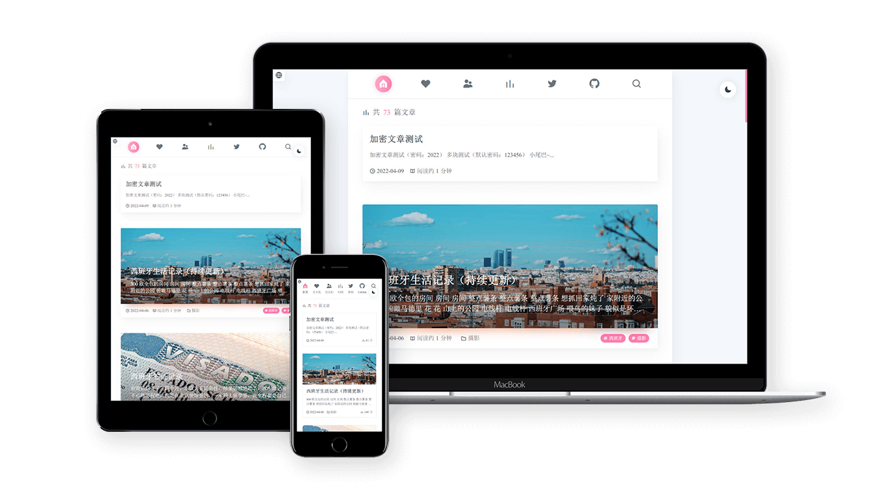

> 一个简约，性能优先，SEO 友好的 Hugo 主题
> 


[👉在线预览](https://hugo-theme-luna.imiku.me/zh-cn) | [English](https://github.com/Ice-Hazymoon/hugo-theme-luna/blob/main/README.md)

## 特性

- 使用 [Tailwindcss](https://tailwindcss.com) 构建，界面美观，SEO友好
- 自定义主题颜色
- 夜间模式
- 画廊模式
- 图片自动压缩，支持 webp 向下兼容
- 支持文章加密（任何情况下都请勿加密重要内容）
- 多语言切换支持
- Google 翻译支持
- PWA 支持
- Pjax 无刷新加载页面，使用 [swup.js](https://swup.js.org/)
- 图片懒加载
- noscript 支持
- 本地搜索支持，使用 [flexsearch](https://github.com/nextapps-de/flexsearch)
- Twitter 页面
- GitHub 页面
- 归档页面
- [GitHub Actions](https://github.com/features/actions) 支持
- 和更多......

## 使用

### - 环境

注意，在使用该主题之前，请确保你遵循以下环境

- **hugo-extended** 版本 >= 0.97.0
- 已安装 **NodeJs**
- 已安装 **postcss-cli**，使用 `npm install postcss-cli -g` 安装

第一次使用 Hugo 可以参考官方的安装手册：[https://gohugo.io/getting-started/installing/](https://gohugo.io/getting-started/installing/)

如果你在使用 Windows，我推荐使用 [Scoop](https://scoop.sh/) 来安装 Hugo：

```bash
scoop install hugo-extended
```

### - 安装主题

在 Hugo 根目录执行

```bash
git clone https://github.com/Ice-Hazymoon/hugo-theme-luna/ themes/hugo-theme-luna
```

在主题 [`exampleSite`](https://github.com/Ice-Hazymoon/hugo-theme-luna/tree/main/exampleSite) 目录有一个 [`config.yaml`](https://github.com/Ice-Hazymoon/hugo-theme-luna/blob/main/exampleSite/config.yaml) 文件，将该文件复制到你的站点目录下并根据需求修改相关内容。

### - 配置

请参考 [`config.yaml`](https://github.com/Ice-Hazymoon/hugo-theme-luna/blob/main/exampleSite/config.yaml) 文件来配置你的博客

如果你喜欢使用 toml，你可以在 [convert yaml to toml](https://www.convertsimple.com/convert-yaml-to-toml) 转换它

如果你需要使用 **Twitter**、**GitHub**、**Search**、**Archives** 等页面，你需要在 `content` 文件夹下创建对应的文件，参考 [cantent](https://github.com/Ice-Hazymoon/hugo-theme-luna/tree/main/exampleSite/content) 文件夹

如果你想要添加一个 **Links** 页面，你可以参考 [这个文件](https://github.com/Ice-Hazymoon/hugo-theme-luna/blob/main/exampleSite/content/zh-hans/links/index.md) 文件的语法

所有图标可以在 [Eva icons](https://akveo.github.io/eva-icons) 查询

你可以设置文章类型为 `type: status` 来发表一篇想法

你可以通过调整 [assets/icon.png](https://github.com/Ice-Hazymoon/hugo-theme-luna/blob/main/assets/icon.png) 文件来修改你的网站图标

### - 加密文章

我建议你使用两个仓库用来管理你的博客，一个私有用于存放博客的源代码，一个公开仓库用于启用 GitHub Pages，如果你需要使用文章加密功能，请一定不要把你的源代码放到公开的仓库上。

**加密功能请勿加密任何重要内容，请小心使用 `.RawContent` 等函数，以免暴露正文**

如果你没用使用 [GitHub Actions](https://github.com/features/actions)，并且你需要使用加密功能，请在每次生成网站之后，执行主题目录下的 [`hugo-encrypt.js`](https://github.com/Ice-Hazymoon/hugo-theme-luna/blob/main/hugo-encrypt.js) 文件

````markdown
{}

### 这里是需要加密的内容

test content


```js
console.log('加密代码块测试');
```
{}
````

## 注意

博客内图片均使用了 Hugo 的 [Image Processing](https://gohugo.io/content-management/image-processing/) 功能，自动裁剪成合适的大小来优化页面加载速度，首次生成可能较为耗费时间。

搜索功能为了减少 json 文件的体积，去除了 shortcode 和代码块等内容，如果有需要，你可以在 [这里](https://github.com/Ice-Hazymoon/hugo-theme-luna/blob/main/layout/_default/search.json) 修改它

如果文章过时提醒不遵循 Git 版本时间的话请设置 `git config --global core.quotepath false`，这是 Hugo 的[问题](https://github.com/gohugoio/hugo/issues/9810)，或许在未来的更新中会得到解决。

新页面的格式请遵循 `archetypes/default.md` 文件，是必须的

如果你开启了 pjax 并且使用了额外的 `<script>` 标签，请在标签上添加 `data-swup-reload-script` 属性，请查看：[https://swup.js.org/plugins/scripts-plugin](https://swup.js.org/plugins/scripts-plugin)

## GitHub Action

将自动部署你的博客到公开仓库

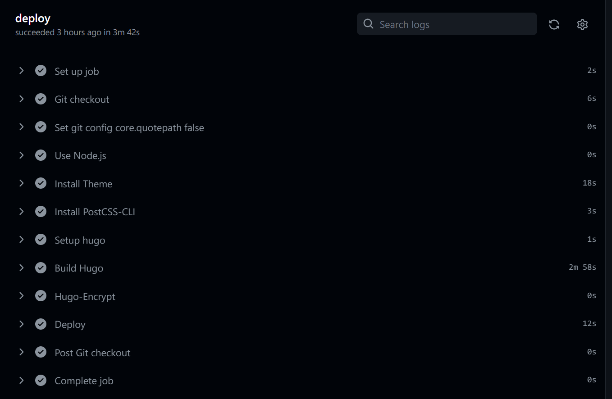

复制主题根目录的 [`.github/workflows/main_example.yml`](https://github.com/Ice-Hazymoon/hugo-theme-luna/blob/edf3a101a93e8e628b534636306fda5985cc1b32/.github/workflows/main_example.yml) 文件到你的博客 `.github/workflows` 目录

修改 `external_repository`, `user_name`, `user_email` 等字段

**注意：如果你需要启用加密功能，你需要有两个 GitHub 仓库，一个私有库用于存放源代码，一个公开仓库用于存放博客，`external_repository` 请设置为你博客的公开仓库**

如果你只有一个仓库，请修改 [`Deploy`](https://github.com/Ice-Hazymoon/hugo-theme-luna/blob/edf3a101a93e8e628b534636306fda5985cc1b32/.github/workflows/main_example.yml#L45) 脚本部分，参考：[actions-gh-pages](https://github.com/peaceiris/actions-gh-pages)

在 [https://github.com/settings/tokens](https://github.com/settings/tokens) 创建一个用于部署的 Token，保存该 Token

在 **github.com/{username}/{project}/settings/secrets/actions** 添加一个 `TOKEN` 字段，输入刚才生成的 token

## 开发

```sh
git clone https://github.com/Ice-Hazymoon/hugo-theme-luna/
cd hugo-theme-luna
hugo server -s ./exampleSite -D --themesDir "../.."
```

## 截图：

> [https://imiku.me](https://imiku.me)

### - 性能测试（关闭 pjax 和 katex 后）

| Lighthouse                                             | GTmetrix                                             |
| ------------------------------------------------------ | ---------------------------------------------------- |
| 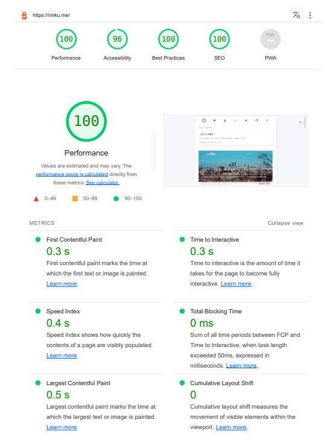 | 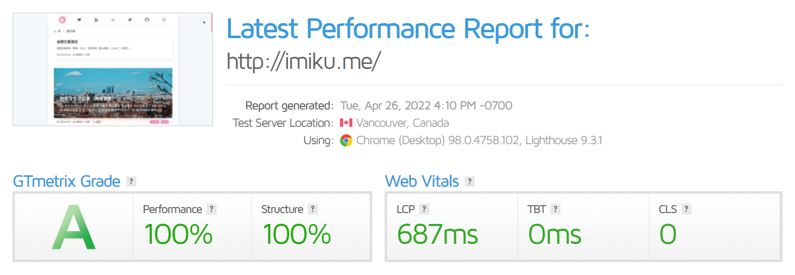 |

### - 页面截图

| <center>首页</center> 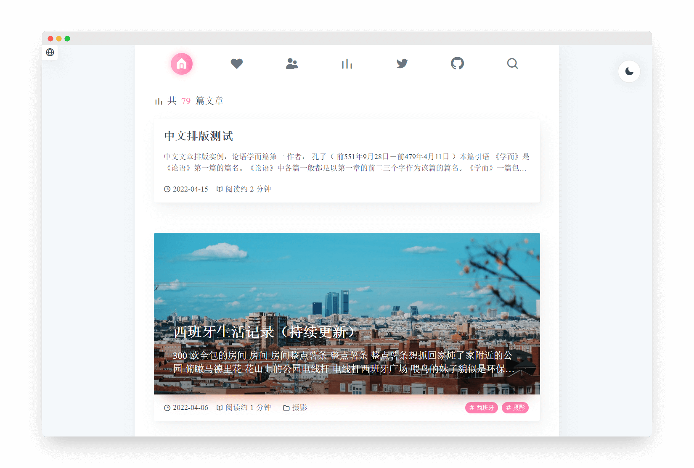                     | <center>首页（夜间模式）</center> 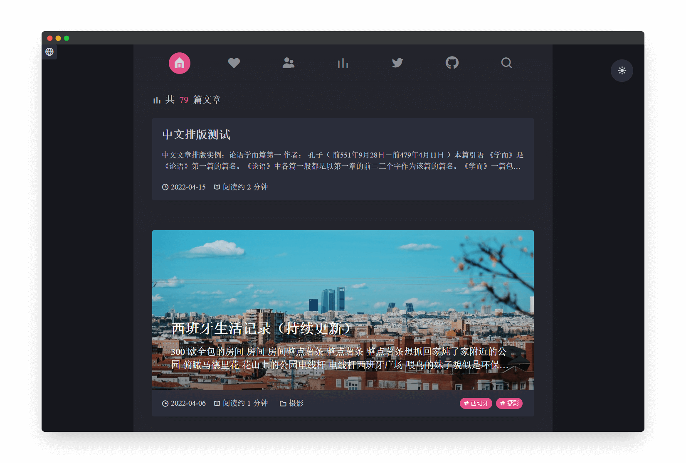 |
| ---------------------------------------------------------------------------------------- | -------------------------------------------------------------------------------------------- |
| <center>标签页</center> 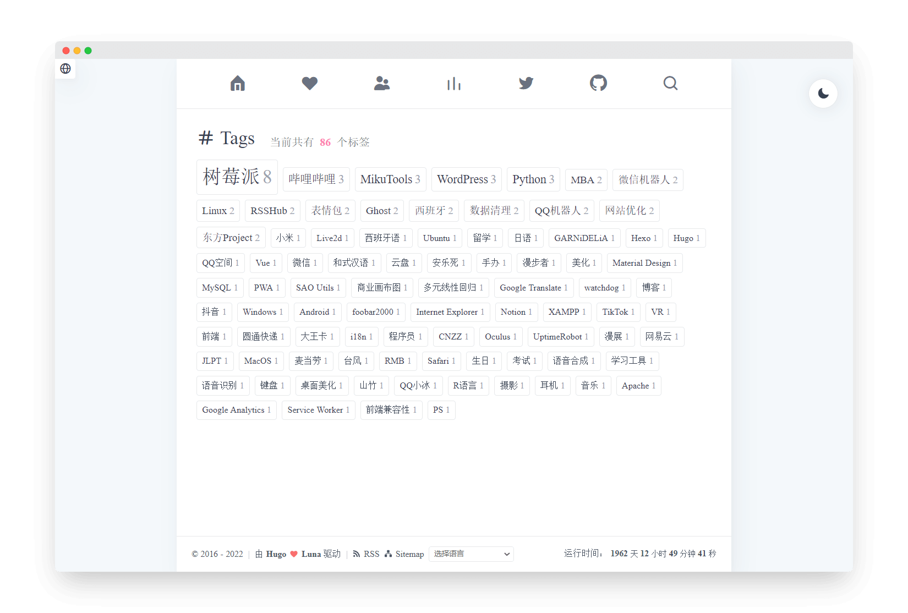                 | <center>搜索页</center> 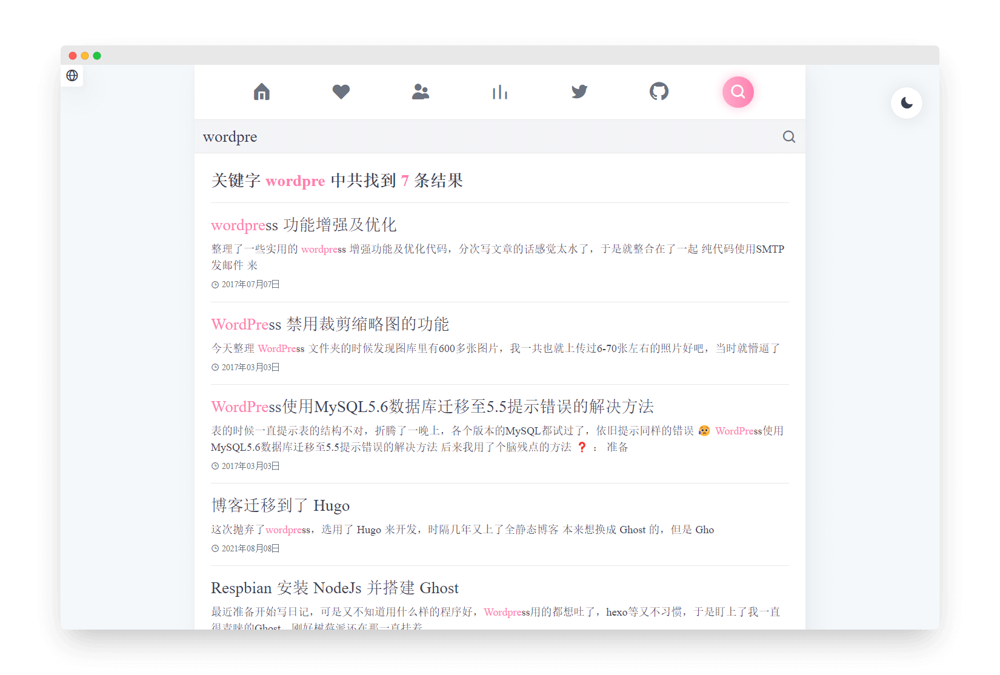                     |
| <center>归档页</center> 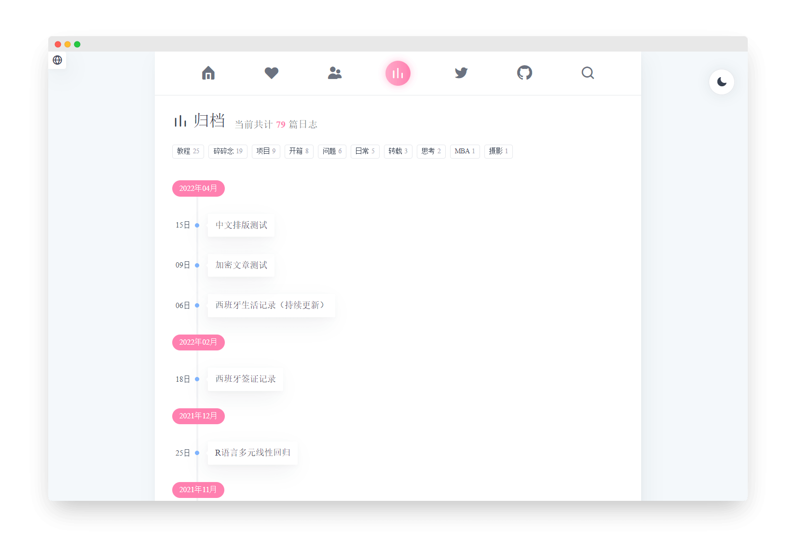                 | <center>友情链接页</center> 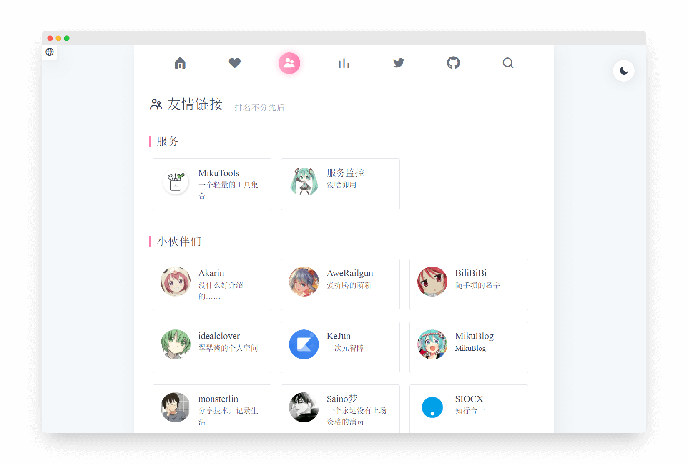             |
| <center>Twitter 动态页</center> 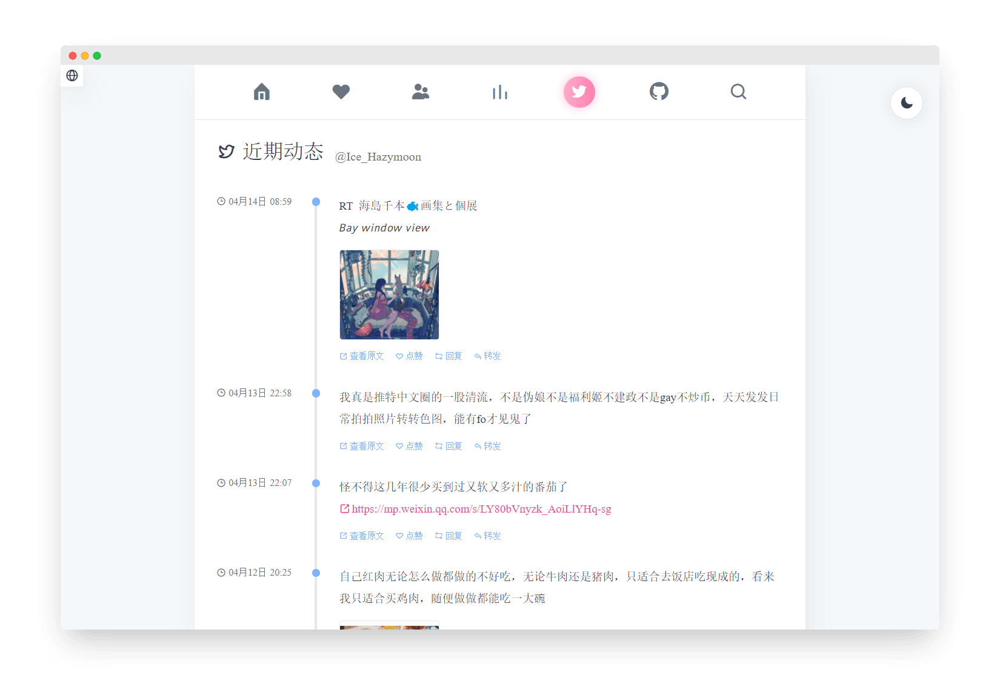 | <center>GitHub</center> 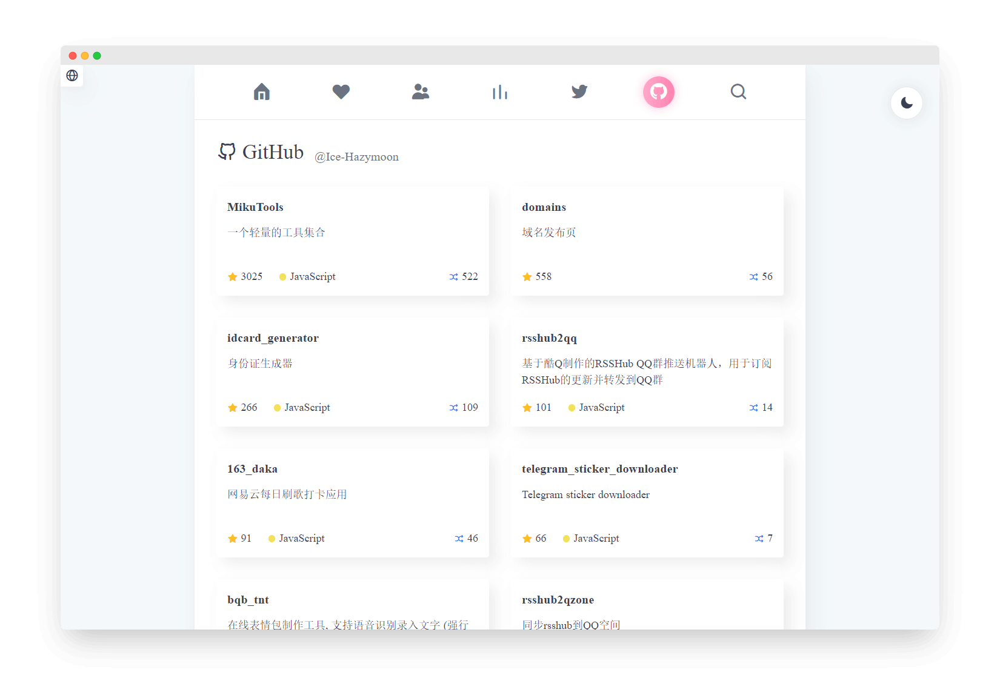                  |
| <center>文章加密</center>              | <center>相册排版</center> 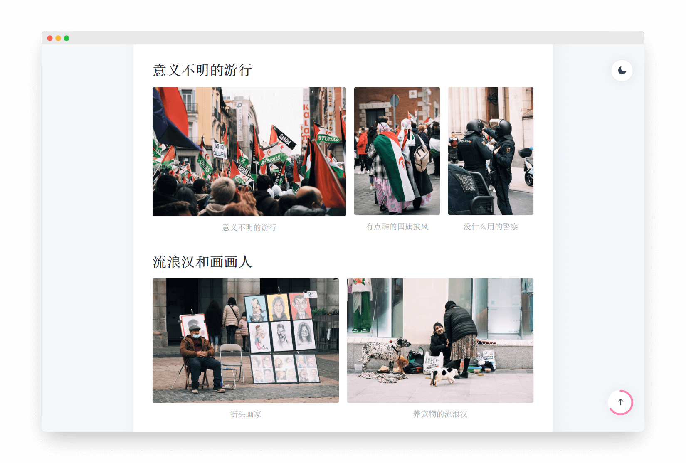                 |

## 致谢

- [https://github.com/olOwOlo/hugo-theme-even](https://github.com/olOwOlo/hugo-theme-even)
- [https://github.com/CaiJimmy/hugo-theme-stack](https://github.com/CaiJimmy/hugo-theme-stack)
- [https://github.com/Izumiko/hugo-encrypt](https://github.com/Izumiko/hugo-encrypt)

## License

主题 使用 [GPL V3.0](https://github.com/Ice-Hazymoon/hugo-theme-luna/blob/main/LICENSE) 协议开源，请遵守此协议进行二次开发等。

您**必须在页脚保留 Luna 主题的名称及其链接**，否则请不要使用该主题。
