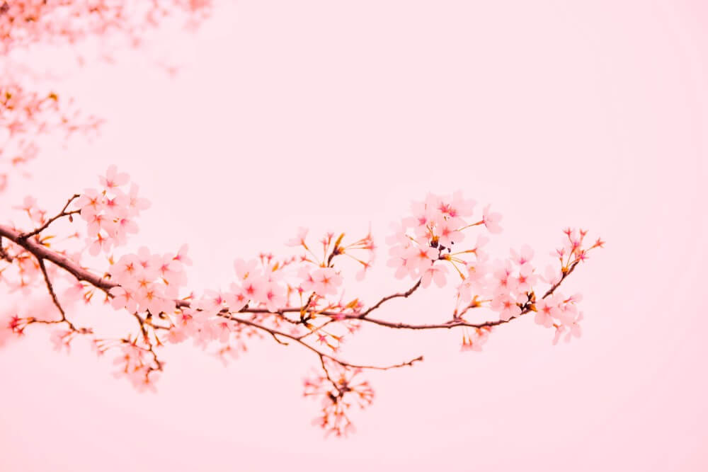

## Spring.


*Today is the day when bold kites fly,*

*When cumulus clouds roar across the sky.*

*When robins return,when children cheer,*

*When light rain beckons spring to appear.*

*Today is the day when daffodils bloom,*

*Which children pick to fill the room,*

*Today is the day when grasses green,*

*When leaves burst forth for spring to be seen.*




## Flower

```markdown
 

   
```

 

   
