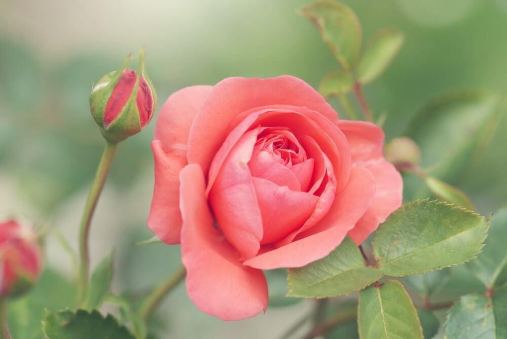
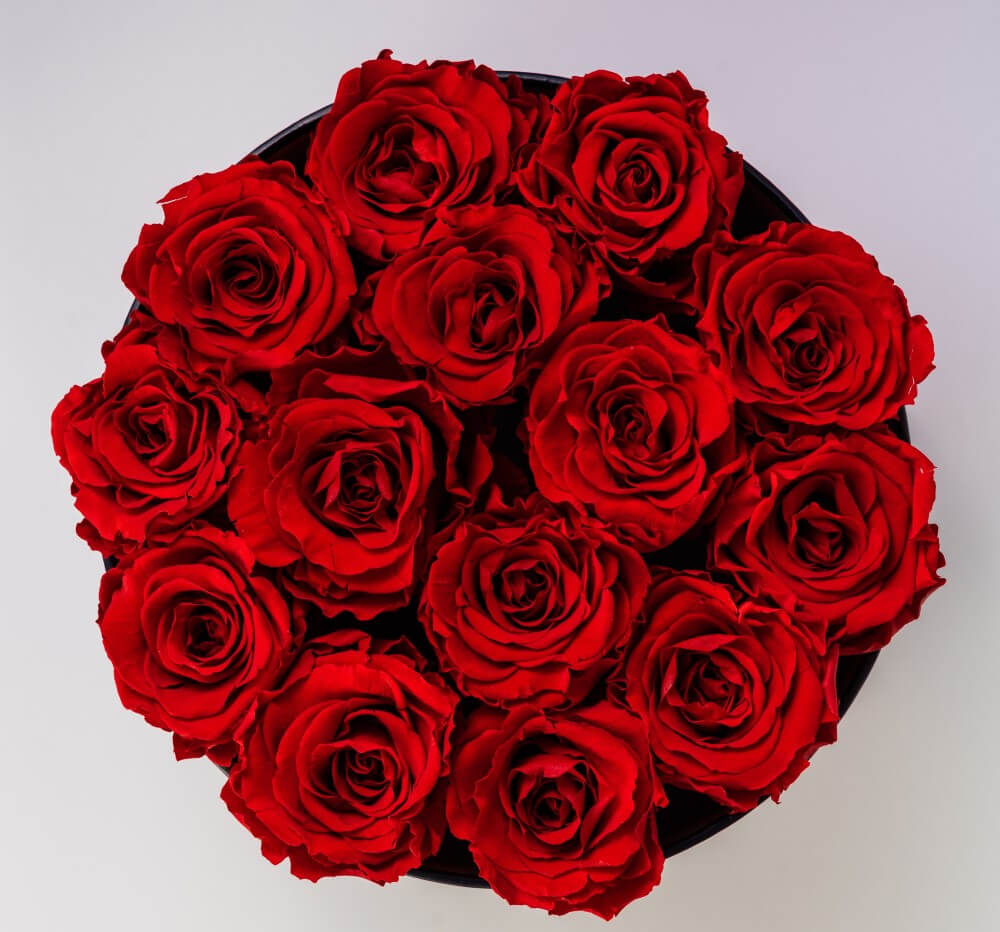

## Abbr

```markdown

```



## Color text

```markdown






```

  
  
  
  
  


## Button

```markdown















```

<div style="font-size: 0;">















</div>

## Text layout

```markdown





```







## GitHub

```markdown

```



## GitHub Auto

```markdown

```



## Notice

```markdown

Let life be beautiful like summer flowers and death like autumn leaves.



Let life be beautiful like summer flowers and death like autumn leaves.



Let life be beautiful like summer flowers and death like autumn leaves.



Let life be beautiful like summer flowers and death like autumn leaves.

```


Let life be beautiful like summer flowers and death like autumn leaves.



Let life be beautiful like summer flowers and death like autumn leaves.



Let life be beautiful like summer flowers and death like autumn leaves.



Let life be beautiful like summer flowers and death like autumn leaves.


## Quote

```markdown

Let life be beautiful like summer flowers and death like autumn leaves.

```


Let life be beautiful like summer flowers and death like autumn leaves.


## Quote Center

```markdown

The curfew tolls the knell of parting day,  
The lowing herd wind slowly o'er the lea  
The ploughman homeward plods his weary way,  
And leaves the world to darkness and to me.

```


The curfew tolls the knell of parting day,  
The lowing herd wind slowly o'er the lea  
The ploughman homeward plods his weary way,  
And leaves the world to darkness and to me.


## Tags

```markdown
This is a   
This is a   
This is a   
This is a   
This is a   

This is a   
This is a   
This is a   
This is a   
This is a   
```

This is a   
This is a   
This is a   
This is a   
This is a   

This is a   
This is a   
This is a   
This is a   
This is a   

## Progress bar

```markdown





```







## Accordion

```markdown

* Vegetables
* Fruits
* Fish

```


* Vegetables
* Fruits
* Fish


## Divided Line

```markdown

```



## Hidden Text

```markdown
This is a 

This is a 
```

This is a 

This is a 


```markdown

> This is a hidden block



* Vegetables
* Fruits
* Fish

```


> This is a hidden block



* Vegetables
* Fruits
* Fish


## Rating

```markdown
The paella dish I rate 
```

The paella dish I rate 

## Links Card

```markdown



```





## Carousel

```markdown



```





## Timeline

```markdown

```



## Gallery

```markdown







```






## Tabs

```markdown



百合花（学名：Lilium）通称百合花，是百合目百合科的一属，为多年生草本球根植物，属内物种繁多，经常作为观赏植物。主要分布在亚洲东部、欧洲、北美洲等北半球温带地区，全球已发现有至少96个品种，其中5种产于台湾。近年更有不少经过人工杂交而产生的新品种，如OT百合、东方型百合、玫瑰百合等。百合属对猫来说有剧毒。



Lilium is a genus of herbaceous flowering plants growing from bulbs, all with large prominent flowers. They are the true lilies. Lilies are a group of flowering plants which are important in culture and literature in much of the world. Most species are native to the northern hemisphere and their range is temperate climates and extends into the subtropics. Many other plants have "lily" in their common names, but do not belong to the same genus and are therefore not true lilies.



Las especies de Lilium, comúnmente llamadas azucenas o lirios, constituyen un género con alrededor de 110 integrantes que se incluye dentro de la familia de las liliáceas. Los lirios son herbáceas perennes de tallos erectos con numerosas hojas alternas, lineares a lance balas. Crecen a partir de bulbos formados por capas de escamas carnosas sin túnica.



```




百合花（学名：Lilium）通称百合花，是百合目百合科的一属，为多年生草本球根植物，属内物种繁多，经常作为观赏植物。主要分布在亚洲东部、欧洲、北美洲等北半球温带地区，全球已发现有至少96个品种，其中5种产于台湾。近年更有不少经过人工杂交而产生的新品种，如OT百合、东方型百合、玫瑰百合等。百合属对猫来说有剧毒。



Lilium is a genus of herbaceous flowering plants growing from bulbs, all with large prominent flowers. They are the true lilies. Lilies are a group of flowering plants which are important in culture and literature in much of the world. Most species are native to the northern hemisphere and their range is temperate climates and extends into the subtropics. Many other plants have "lily" in their common names, but do not belong to the same genus and are therefore not true lilies.



Las especies de Lilium, comúnmente llamadas azucenas o lirios, constituyen un género con alrededor de 110 integrantes que se incluye dentro de la familia de las liliáceas. Los lirios son herbáceas perennes de tallos erectos con numerosas hojas alternas, lineares a lance balas. Crecen a partir de bulbos formados por capas de escamas carnosas sin túnica.



